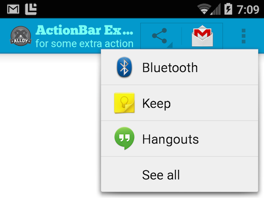

# ActionBarExtras [](http://gitt.io/component/com.alcoapps.actionbarextras)

This module provides some extra functionality to configure the ActionBar that Titanium doesn't offer.



## Features
  * Title and Subtitle
  * Sharing Action Provider
  * force overflow
  * backgroundColor
  * custom fonts
  * font color
  * disable icon

## Get it [](http://gitt.io/component/com.alcoapps.actionbarextras)
Download the latest distribution ZIP-file and consult the [Titanium Documentation](http://docs.appcelerator.com/titanium/latest/#!/guide/Using_a_Module) on how install it, or simply use the [gitTio CLI](http://gitt.io/cli):

`$ gittio install com.alcoapps.actionbarextras`

## Using it

First require it:

```javascript
var abx = require('com.alcoapps.actionbarextras');
```

At this point the feature for forcing the "menu overflow" has been attached to your Activity, so if that's the only thing you were looking for, you're set.

Now, you can set custom properties like this:
```javascript
// setting extras
abx.title = "The Title";
abx.titleFont = "Chunkfive.otf";
abx.titleColor = "blue";
```

To see what else you can do, see:
* [Example project](example/)
* [Documentation](documentation/index.md)

## Some apps using ActionBarExtras

* [Collapp](https://play.google.com/store/apps/details?id=tv.collapp.app)
* [Peerby](https://play.google.com/store/apps/details?id=com.peerby.peerby)

> Make sure you send me your app links or a PR with an updated README.md

## Contribuitors

* [Ricardo Alcocer](https://github.com/ricardoalcocer)
* [Timan Rebel](https://github.com/timanrebel)
* [Manuel Lehner](https://github.com/manumaticx)

## License
MIT License - [http://alco.mit-license.org](http://alco.mit-license.org)
