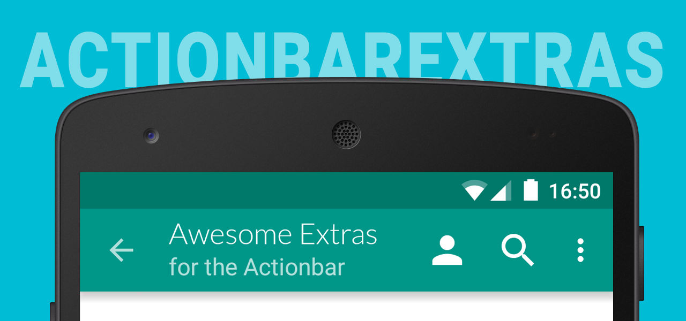

# ActionBarExtras 
[](android/dist/)
[](http://mit-license.org)
[](https://github.com/ricardoalcocer/actionbarextras/issues)

- [Overview](#overview)
- [Features](#features)
- [Installation](#installation)
- [Example](example/)
- [API docs](assets/index.md)
- [Apps](#some-apps-using-actionbarextras)
- [Contributors](#contributors)
- [License](#license)

## Overview
This module provides some extra functionality to configure the ActionBar that Titanium doesn't offer.

## Features
  * Title and Subtitle
  * Sharing Action Provider
  * Dropdown menu
  * font: type, color, size, weight
  * FontAwesome support for title, logo and menu
  * and many more...

## Installation
Download the latest ZIP from [android/dist](android/dist/) and consult the [Titanium documentation](https://titaniumsdk.com/guide/Titanium_SDK/Titanium_SDK_How-tos/Using_Modules/Using_a_Module.html) on how to install it.

To build the module yourself, run `ti build -p android --build-only` inside the `android/` folder.

### Using it

First require it:

```javascript
var abx = require('com.alcoapps.actionbarextras');
```

At this point the feature for forcing the "menu overflow" has been attached to your Activity, so if that's the only thing you were looking for, you're set.

Now, you can set custom properties like this:
```javascript
// NOTE: make sure that your window is open 
// before you access the actionbar with abx
win.addEventListener('open',function(e){
  // setting extras
  abx.title = "The Title";
  abx.titleFont = "Chunkfive.otf";
  abx.titleColor = "blue";
});
```

To see what else you can do, see:
* [Example project](example/)
* [Documentation](assets/index.md)

## Some apps using ActionBarExtras

* [Peerby](http://goo.gl/0JwYWj)
* [Collapp](http://goo.gl/zA7KZz)
* [Unit+Size Converter](http://goo.gl/QMWNrK)
* [PiniOn](https://play.google.com/store/apps/details?id=br.com.pinion)
* [SpotHere](https://play.google.com/store/apps/details?id=mobi.spotapp.spothere)

> Make sure you send me your app links or a PR with an updated README.md

## Contributors

See [contributors](https://github.com/ricardoalcocer/actionbarextras/graphs/contributors)

## License
MIT License - [http://alco.mit-license.org](http://alco.mit-license.org)
